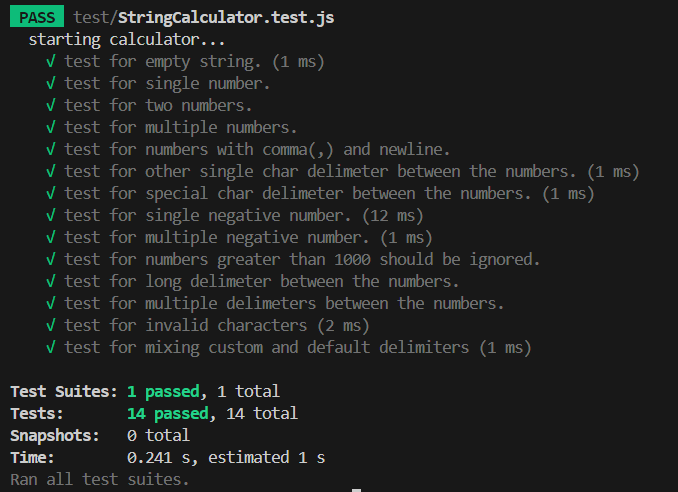

# 🧮String Calculator - TDD 

This repository contains a complete implementation of the classic **String Calculator** using **Test-Driven Development (TDD)** with **JavaScript** and **Jest**.

Each feature has been built incrementally by following the Red-Green-Refactor TDD cycle and committing changes in very small steps to reflect the real development process.

---

## 🎯 Objective

Implement a `StringCalculator` class with a single method `add(string)` that parses a string input containing numbers separated by delimiters and returns their sum. The rules evolve step-by-step through specifications.

---

## 💻 Method Signature

```js
add(numbers: string): number
```

---

## 🧪 Test Cases (`StringCalculator.test.js`)

| 🧪 Test Case Description                              | 🧾 Input                  | 🎯 Output                               | ✔️ Status |
| ----------------------------------------------------- | ------------------------- | --------------------------------------- | --------- |
| Empty input returns 0                                 | `""`                      | `0`                                     | ✅         |
| Handles a single number                               | `"1"`                     | `1`                                     | ✅         |
| Handles two numbers                                   | `"1,2"`                   | `3`                                     | ✅         |
| Handles multiple numbers                              | `"1,2,3"`                 | `6`                                     | ✅         |
| Supports newline (`\n`) as delimiter                  | `"1\n2,3"`                | `6`                                     | ✅         |
| Custom single-character delimiter                     | `"//;\n1;2"`              | `3`                                     | ✅         |
| Handles special character delimiter                   | `"//*\n1*2*3"`            | `6`                                     | ✅         |
| Throws exception for negative numbers                 | `"3,4,-8"`                | Exception: `-8`                         | ✅         |
| Throws exception for multiple negative numbers        | `"-7,-9,-10"`             | Exception: `-7, -9, -10`                | ✅         |
| Ignores numbers greater than 1000                     | `"1001,2"`                | `2`                                     | ✅         |
| Supports multi-character delimiters                   | `"//[***]\n1***2***3"`    | `6`                                     | ✅         |
| Supports multiple delimiters           | `"//[***][%%]\n1***2%%3"` | `6`                                     | ✅         |
| Invalid characters         | `"1,abc,2"`       | Invalid number:`abc`                                     | ✅         |
| Throws error on mixed use of default and custom delim | `"//[***]\n1***2,3"`      | Exception: Unexpected default delimiter | ✅         |


---

## 🔄 Red-Green-Refactor Cycle

Every feature was implemented with:

1. **Red** - Write a failing test case
2. **Green** - Write minimum code to make it pass
3. **Refactor** - Clean the implementation without breaking tests

💡Commits were made frequently to clearly separate these stages.

---

## 🛠 Tech Stack

* JavaScript (ES6)
* Jest (unit testing)
* Node.js

---

## 💡 Highlights

* Handles **edge cases** like special characters, mixed delimiter conflicts, and multi-delimiter logic
* Well-commented, modular code for readability
* Detailed test coverage with descriptive test cases

---

## 📸 Test Coverage Screenshot



---

## 🔗 Run Instructions

```bash
npm install
npm test
```

---

## 📁  Folder Structure

```
Tdd-incubyte-assesment
│
├──📂assets/
│   └──🖼️ passedTestcases.png          # Test results screenshot
│
├──📂 src/
│   └──📄StringCalculator.js           # Main implementation
│
├──📂test/
│   └──📄StringCalculator.test.js      # Comprehensive test suite
│
├── 📄package.json                     # Dependencies and scripts
│
├── 📄README.md
│
└── 📄 .gitignore                      # Git ignore rules
```

---

## 🏁 Conclusion

This project is more than just a calculator. It's a practical example of **how Test-Driven Development (TDD)** enables building robust software through incremental design, ensuring correctness, clarity, and confidence in code changes.

Feel free to clone and run it, or use this as a base for practicing your own TDD Katas!

## 🙏 Special Thanks

* To **Incubyte** for designing this brilliant exercise of TDD.This exercise helped reinforce my belief that good tests drive good design — and I truly enjoyed practicing TDD with it.